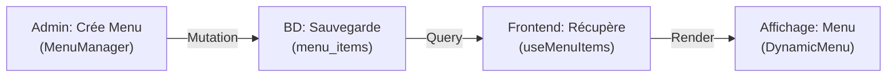

# 🔄 Synchronisation Menu - Admin ↔ Frontend

## ✅ Architecture Mise en Place

Le menu est maintenant **100% dynamique** et synchronisé avec la base de données Supabase.

### 🏗️ Structure

```
Database (menu_items table)
    ↓
useMenuItems() hook
    ↓
DynamicMenu component
    ↓
Header affiche menu dynamique
```

---

## 📋 Composants Créés

### 1️⃣ `MenuManager.tsx` (Admin)
Interface complète pour gérer le menu depuis l'admin:
- ✅ Ajouter des menus
- ✅ Éditer des menus existants
- ✅ Supprimer des menus
- ✅ Organiser par type (Main, Footer, Social)
- ✅ Définir l'ordre d'affichage

**Accès:** `/admin` → "Gestionnaire de Menu"

### 2️⃣ `DynamicMenu.tsx` (Frontend)
Composant réutilisable pour afficher les menus:
- ✅ Récupère dynamiquement depuis BD
- ✅ Filtre par type et statut actif
- ✅ Supporte liens internes `/path` et externes `https://`
- ✅ Support des icônes personnalisées
- ✅ Classes CSS customisables

**Usage:**
```tsx
<DynamicMenu 
  type="main" 
  className="flex gap-4"
  itemClassName="text-blue-600 hover:text-blue-800"
/>
```

### 3️⃣ `useMenuItems.ts` (Hook)
Hook React Query pour gérer les menus:
- ✅ Lecture des menus avec `useMenuItems()`
- ✅ Création avec `useCreateMenuItem()`
- ✅ Modification avec `useUpdateMenuItem()`
- ✅ Suppression avec `useDeleteMenuItem()`
- ✅ Invalidation cache automatique

---

## 🗄️ Table `menu_items`

```sql
CREATE TABLE menu_items (
  id UUID PRIMARY KEY,
  title TEXT NOT NULL,           -- Texte affiché
  url TEXT NOT NULL,             -- Lien (/formations ou https://...)
  target TEXT DEFAULT '_self',   -- _self ou _blank
  parent_id UUID,                -- Pour menus imbriqués (optionnel)
  menu_order INTEGER,            -- Ordre d'affichage
  is_active BOOLEAN DEFAULT true,-- Visible/caché
  menu_type TEXT,                -- 'main' | 'footer' | 'social'
  icon TEXT,                     -- Icône (Lucide, emoji, etc)
  label TEXT,                    -- Label personnalisé (sinon title)
  created_at TIMESTAMPTZ,
  updated_at TIMESTAMPTZ
);
```

---

## 📝 Types de Menus

| Type | Usage | Exemple |
|------|-------|---------|
| **main** | Menu principal du header | Accueil, Formations, Contact |
| **footer** | Menu pied de page | Mentions légales, CGU, Politique |
| **social** | Liens réseaux sociaux | Facebook, LinkedIn, Twitter |

---

## 🚀 Utilisation

### A. Ajouter un Menu depuis l'Admin

1. Allez sur `/admin`
2. Cliquez "Gestionnaire de Menu"
3. Remplissez les champs:
   - **Titre**: "Formations"
   - **URL**: "/formations"
   - **Type**: "Menu Principal"
4. Cliquez "Ajouter"

✅ Le menu s'affiche automatiquement au frontend!

### B. Utiliser le Menu dans un Composant

```tsx
import { DynamicMenu } from '@/components/DynamicMenu';

function MyComponent() {
  return (
    <header>
      <DynamicMenu 
        type="main"
        className="flex gap-4 items-center"
        itemClassName="px-3 py-2 hover:bg-gray-100 rounded"
      />
    </header>
  );
}
```

### C. Afficher les Pages du WordPress-like

Pour que les **pages dynamiques** s'affichent dans le menu:

1. Créez une page dans l'admin:
   - Titre: "Actualités"
   - Slug: "actualites"

2. Créez un menu pour cette page:
   - Titre: "Actualités"
   - URL: `/page/actualites` (ou `/actualites` selon vos routes)
   - Type: "Menu Principal"

3. ✅ Le lien apparaît dans le header!

---

## 🔄 Flux de Synchronisation



---

## 🎨 Personnalisation

### Ajouter des Icônes

```tsx
// Dans MenuManager, remplissez le champ "Icône":
"🏠"              // Emoji
"fas fa-home"     // FontAwesome
"lucide:Home"     // Lucide icon name
```

### Personnaliser l'Affichage

```tsx
<DynamicMenu 
  type="main"
  className="flex flex-col gap-2 p-4"
  itemClassName="text-lg font-bold text-blue-600 hover:text-blue-800 transition"
/>
```

### Menus Imbriqués

```sql
-- Créer un sous-menu
INSERT INTO menu_items (title, url, menu_type, parent_id, menu_order)
VALUES ('Certifications', '/certifications', 'main', 
        (SELECT id FROM menu_items WHERE title = 'Formations'), 
        1);
```

---

## ✨ Avantages

| Avant | Après |
|-------|-------|
| Menu codé en dur dans Header.tsx | ✅ Menu dans BD |
| Ajouter un lien = éditer le code | ✅ Ajouter via interface |
| Pas de synchronisation avec pages | ✅ Lien pages ↔ menu |
| 1 menu pour tous | ✅ Menus multiple (main, footer, social) |

---

## 🔧 Prochaines Étapes

1. **Intégrer MenuManager dans AdminDashboard**
   ```tsx
   import { MenuManager } from '@/components/admin/MenuManager';
   
   <Route path="/admin/menu" element={<MenuManager />} />
   ```

2. **Remplacer megaMenuSections dans Header.tsx**
   - Utiliser `<DynamicMenu type="main" />` au lieu de `megaMenuSections`

3. **Ajouter des menus depuis l'admin**
   - Accédez à `/admin/menu`
   - Créez les menus principaux

4. **Tester la synchronisation**
   - Créez un menu
   - Rechargez la page
   - Le menu s'affiche automatiquement ✅

---

## 📊 États Actuels

```
✅ Table menu_items créée
✅ Hooks useMenuItems created
✅ MenuManager component créé
✅ DynamicMenu component créé
⏳ Intégration dans Header.tsx (optionnelle)
⏳ Intégration dans Admin Dashboard (optionnelle)
```

---

**Félicitations! Votre menu est maintenant dynamique et synchronisé avec l'admin! 🎉**
