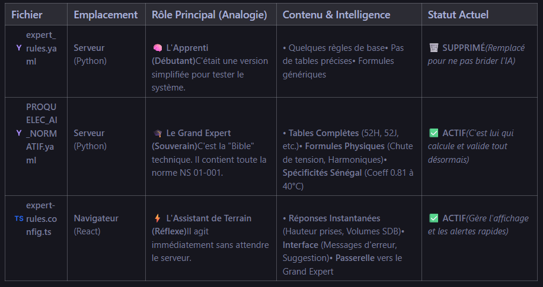

Voici les fichiers exacts que votre "AI Souveraine" utilise pour garantir sa conformité normative (basée sur le code analysé) :

1. Le Cerveau Logique (Règles Expertes)
Fichier : haystack_backend/expert_rules.yaml
Rôle : C'est ici que sont codées "en dur" les formules physiques et les règles de conformité.
Exemples trouvés dedans : Formule de chute de tension, règles des volumes de salle de bain (Volume 0, 1, 2), correction thermique pour le Sénégal (0.81 à 40°C), etc.
2. La Base de Connaissances Indexée (Pour la Recherche)
Fichier : src/docs/NS01001/FINAL_DATA/NS01001_v2_core.json
Rôle : Ce fichier contient le texte complet et structuré de la norme NS 01-001. C'est ce fichier que le serveur (server.py) charge en mémoire pour trouver les articles de loi exacts quand vous posez une question.
3. La Bibliothèque de Référence (Documents Bruts)
Dossier : public/normative-corpus/
Contenu : Ce dossier contient 84 fichiers PDF originaux qui servent de source de vérité.
Fichiers clés :
Norme NS 01-001.pdf (La norme Sénégalaise principale)
Norme NF C 14-100.pdf (Raccordement Enedis/Senelec)
NF C15-100 (Norme française de référence)
Divers guides techniques (PNS ..., Guide UTE, etc.)
L'IA fonctionne en combinant ces trois sources : elle utilise le JSON pour trouver le texte, le YAML pour appliquer les mathématiques/règles, et les PDF sont là pour la certification/preuve.

Voici le tableau comparatif des 3 fichiers que nous avons manipulés, chacun ayant un rôle précis dans votre architecture d'Intelligence Artificielle Souveraine :

Fichier	Emplacement	Rôle Principal (Analogie)	Contenu & Intelligence	Statut Actuel
expert_rules.yaml
Serveur (Python)	🧠 L'Apprenti (Débutant)C'était une version simplifiée pour tester le système.	• Quelques règles de base• Pas de tables précises• Formules génériques	🗑️ SUPPRIMÉ(Remplacé pour ne pas brider l'IA)
PROQUELEC_AI_NORMATIF.yaml
Serveur (Python)	🎓 Le Grand Expert (Souverain)C'est la "Bible" technique. Il contient toute la norme NS 01-001.	• Tables Complètes (52H, 52J, etc.)• Formules Physiques (Chute de tension, Harmoniques)• Spécificités Sénégal (Coeff 0.81 à 40°C)	✅ ACTIF(C'est lui qui calcule et valide tout désormais)
expert-rules.config.ts
Navigateur (React)	⚡ L'Assistant de Terrain (Réflexe)Il agit immédiatement sans attendre le serveur.	• Réponses Instantanées (Hauteur prises, Volumes SDB)• Interface (Messages d'erreur, Suggestion)• Passerelle vers le Grand Expert	✅ ACTIF(Gère l'affichage et les alertes rapides)
Résumé de l'interaction :
L'utilisateur pose une question dans l'interface.
expert-rules.config.ts
 vérifie si c'est une question simple (ex: "Hauteur prise ?"). Si oui, il répond tout de suite (0ms).
Si c'est complexe (ex: "Calcul de section enterrée à 45°C ?"), il envoie la demande au Serveur.
Le Serveur utilise 
PROQUELEC_AI_NORMATIF.yaml
 pour faire le calcul scientifique exact et renvoie la réponse certifiée.

